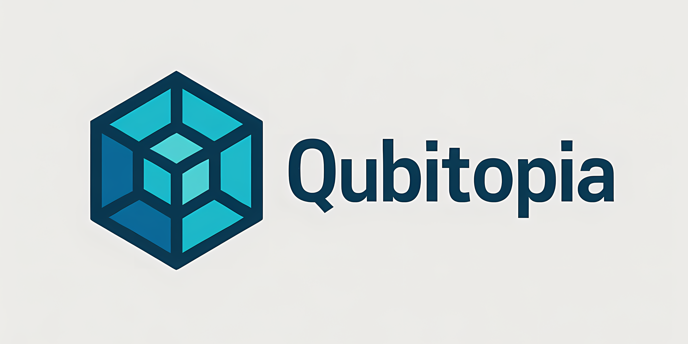

# QuantumScholar

   

   

   

---

> "Empowering secure, fair, and scalable online assessments with AI."

## Overview

**QuantumScholar** is an AI-based proctoring website designed to ensure secure, fair, and scalable online assessments. Leveraging advanced artificial intelligence, it provides real-time monitoring, identity verification, and automated analysis to detect suspicious activities during online exams.

---

This Project has ben archived and split into diffrent repositories for simplification nad better managment of the project. You can check the following repositories for any update.

Website : https://github.com/Qubitopia/quantum-scholar-web
Backend : https://github.com/Qubitopia/quantum-scholar-backend
Test cum Anticheat Software : https://github.com/Qubitopia/quantum-scholar-proctoring-agent
